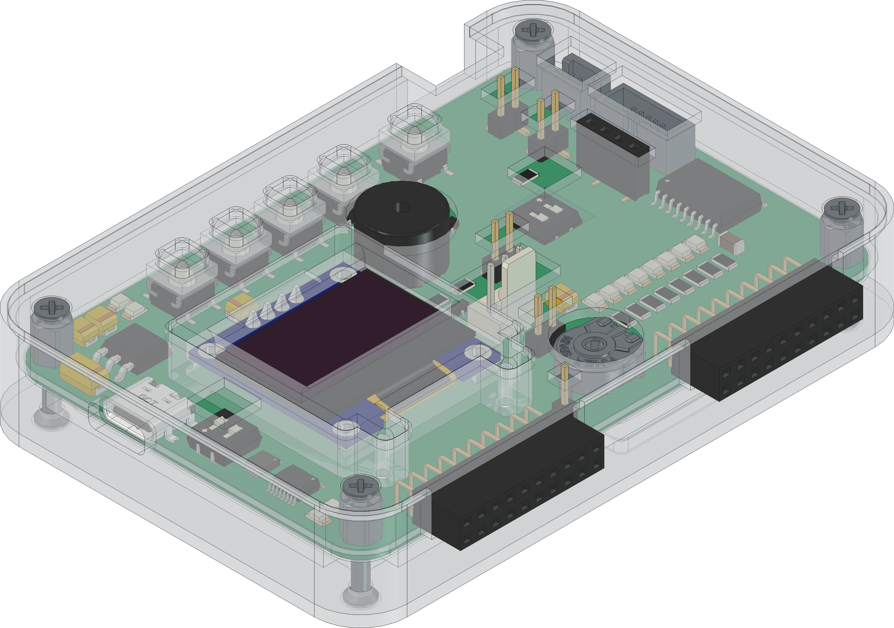

  

# `MGC` - MeGARCard

The `MGC` is built as base development board with a set of push-buttons, leds, potentiometers and many more components on-board. It builds the base platform for a bunchset of adaptable microcontrolles (e.g. `ATmega16A`, `ATmega4808`, `ESP32`). It simplifies the development process by extending supported microcontrollers to a range of actuators and sensors. The board itself regulates the voltage to `5V` or `3V3` automatically with a power mux ([TPS2116](#additional-information)). If `3V3` and `5V` are suppored, the voltage can be changed on the dip switch of the adaptable microcontroller board. The base board supports a usb or uart-interface [FT230XS](#additional-information) to the adaptable microcontroller. The usb mode can be switched over a usb-multiplexer [TS3USB30](#additional-information) within the dip switch on the base board. The leds on the base bord are controlled over a transistor array [TBD62783](#additional-information) that keeps the input current on a very low state. 

> Note that the board should be disconnected from power sources when changing the state of the dip switches on the base or microcontroller adapter board.

| Experience  | Level                                                                               |
|:------------|:-----------------------------------------------------------------------------------:|
| Soldering   |  |
| Mechanical  |     |

# Adapter-Boards

| ATmega16A | ATmega4809 | ESP32 |
|:---------:|:----------:|:-----:|
|  |  |  |
| Schematic | Schematic | Schematic |
| [pdf](https://github.com/0x007E/mgc_m16a/releases/latest/download/schematic.pdf) / [cadlab](https://cadlab.io/projects/mgc-atmega16a-module) | [pdf](https://github.com/0x007E/mgc_atmega4809/releases/latest/download/schematic.pdf) / [cadlab](https://cadlab.io/projects/mgc-atmega4809-module) | [pdf](https://github.com/0x007E/mgc_esp32/releases/latest/download/schematic.pdf) / [cadlab](https://cadlab.io/projects/mgc-atmega4809-module) |
| [GitHub](https://github.com/0x007e/mgc_m16a) | [GitHub](https://github.com/0x007e/mgc_m4809) | [GitHub](https://github.com/0x007e/mgc_esp32) |

# Downloads

| Type      | File                                                                                                                                                 | Description     |
|:---------:|:----------------------------------------------------------------------------------------------------------------------------------------------------:|:----------------|
| Schematic | [pdf](https://github.com/0x007E/mgc/releases/latest/download/schematic.pdf) / [cadlab](https://cadlab.io/project/30413/main/files)                   | Schematic files |
| Board     | [pdf](https://github.com/0x007E/mgc/releases/latest/download/pcb.pdf) / [cadlab](https://cadlab.io/project/30413/main/files)                         | Board file      |
| Drill     | [pdf](https://github.com/0x007E/mgc/releases/latest/download/drill.pdf)                                                                              | Drill file      |
| BoM | [xlsx](https://github.com/0x007E/mgc/releases/latest/download/bom.xlsx) / [html](https://github.com/0x007E/mgc/releases/latest/download/bom.html)          | Bill of Material as Excel/interactive HTML |
| PCB    | [zip](https://github.com/0x007E/mgc/releases/latest/download/kicad.zip) / [tar](https://github.com/0x007E/mgc/releases/latest/download/kicad.tar.gz)    | KiCAD/Gerber/BoM/Drill files       |
| Mechanical | [zip](https://github.com/0x007E/mgc/releases/latest/download/freecad.zip) / [tar](https://github.com/0x007E/mgc/releases/latest/download/freecad.tar.gz) | FreeCAD/Housing and PCB (STEP/STL) files     |

# Hardware

The pcb is created with `KiCAD`, the housing with `FreeCAD`. All files are built with `github actions` so that they are ready for a production environment.

## PCB

The circuit board is populated on both sides (Top, Bottom). The best way for soldering the `SMD` components is within a vapor phase soldering system and for the `THT` components with a standard soldering system.

### Top Layer

### Bottom Layer

## Mechanical

The housing has a tolerance of `0.2mm` on each side of the case. So the pcb should fit perfectly in the housing. The tolerance can be modified with `FreeCAD` in the `Parameter` Spreadsheet.

### Assembled

### Exploded

# Additional Information

| Type       | Link               | Description              |
|:----------:|:------------------:|:-------------------------|
| FT230XS    | [pdf](https://ftdichip.com/wp-content/uploads/2021/10/DS_FT230X.pdf) | USB/UART-Bridge |
| TS3USB30 | [pdf](https://www.ti.com/lit/ds/symlink/ts3usb30e.pdf) | USB-Multiplexer 1:2 |
| TPS2116 | [pdf](https://www.ti.com/lit/ds/symlink/tps2116.pdf) | Power Mux with Manual and Priority Switchover |
| TBD62783 | [pdf](https://toshiba.semicon-storage.com/info/datasheet_en_20160511.pdf) | DMOS transistor array |

---
